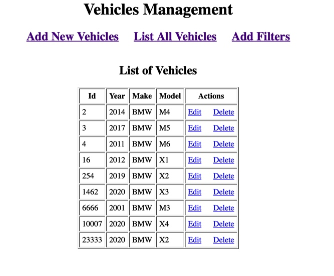
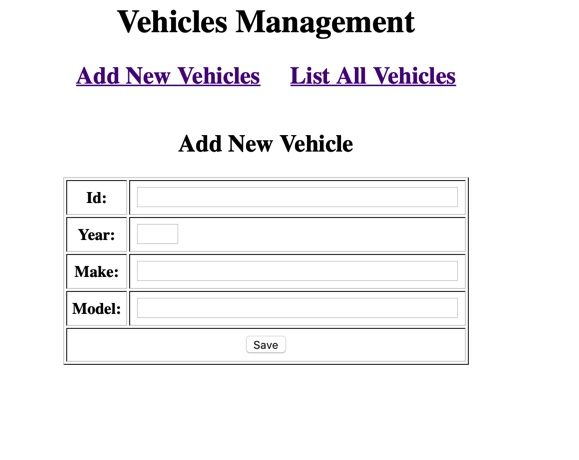
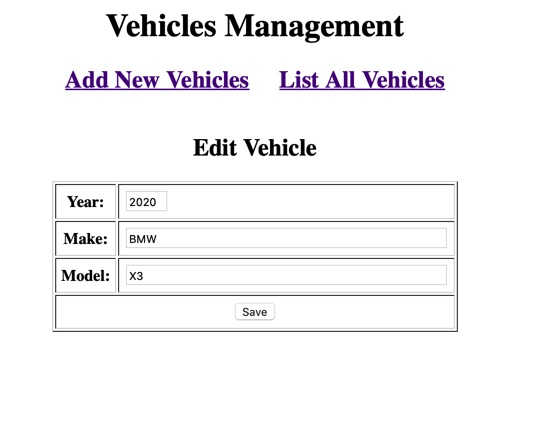
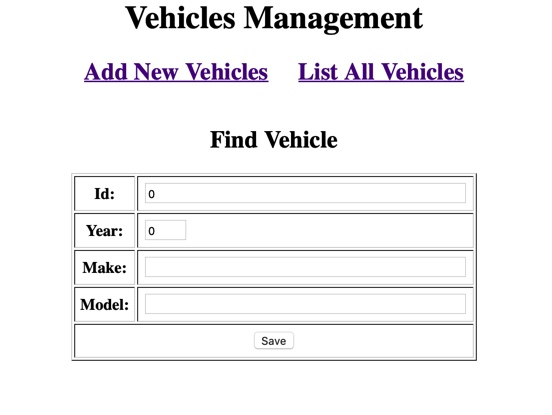
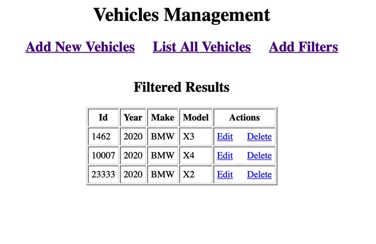

# [VehicleCRUD]  MAVEN PROJECT
## Project Overview:
This project provide basic CRUD functionalities on a vehicle database. Filtering vehicles given certain conditions is also allowed. I utilize maven framwork, servlet services to build a client to help users visualize data in the database. The project uses JDBC services to provide a in-memory persistent implementation. A series of tests are done via JUnit, allowing automated tested for proper functionality.

My implementation embraces reusability, portability, security, and scalability. A few changes like appending attributes for Vehicle entity may be easily adapted. The Data Access Class and Servlet Controller class can also be transfer to perform same functions on other entities like employment informations. Unless required, all methods are either protected or private to enhance security.

 Please read the following guide to set up and deploy the project. Should you have any problems, please contact me at xlijacob@gmail.com . Thanks!
 
@ Xiaochen Li Jacob 

## Guide
### Setup
please first check if all maven dependencies  are in `pom.xml` file. All dependencies must be included to successfully deploy the project.
1. Servlet
2. jstl
3. mysql `8.0.19`
4. junit
```xml
<dependency>
  <groupId>javax.servlet</groupId>
  <artifactId>javax.servlet-api</artifactId>
  <version>3.1.0</version>
  <scope>provided</scope>
</dependency>
<dependency>
  <groupId>javax.servlet.jsp</groupId>
  <artifactId>javax.servlet.jsp-api</artifactId>
  <version>2.3.1</version>
  <scope>provided</scope>
</dependency>
<dependency>
  <groupId>jstl</groupId>
  <artifactId>jstl</artifactId>
  <version>1.2</version>
</dependency>
<dependency>
  <groupId>mysql</groupId>
  <artifactId>mysql-connector-java</artifactId>
  <version>8.0.19</version>
</dependency>
<dependency>
  <groupId>org.junit.jupiter</groupId>
  <artifactId>junit-jupiter-api</artifactId>
  <version>5.4.2</version>
</dependency>
 
```
Check all plugins
```xml
<plugin>
  <artifactId>maven-compiler-plugin</artifactId>
  <version>3.8.0</version>
  <configuration>
    <release>10</release>
  </configuration>
</plugin>
<plugin>
  <artifactId>maven-war-plugin</artifactId>
  <version>3.2.3</version>
  <configuration>
    <warSourceDirectory>WebContent</warSourceDirectory>
  </configuration>
</plugin>
```
Libraries
* JUnit 5
* Tomcat Server 8.0

Tools used:
* eclipse

Personalize all fields essential for JDBC to connect to your local database, the file `web.xml` can be found under WebContent directory. Please set to your username and password in the places indicate by capitalized letters.

```
<context-param>
<param-name>jdbcUsername</param-name>
<param-value>USERNAME</param-value>
</context-param>
<context-param>
<param-name>jdbcPassword</param-name>
<param-value>YOURPASSWORD</param-value>
</context-param>
```

Connect to the production database, my creating a new mySQL database:
```
CREATE DATABASE `VehicleCRUD`;
USE VEHICLEDB;

CREATE TABLE `vehicle` (
  `Id` int(11) NOT NULL  ,
  `Year` int(4) NOT NULL,
  `Make` varchar(128) NOT NULL,
  `Model` varchar(45) NOT NULL,
  PRIMARY KEY (`Id`),
  UNIQUE KEY `Id_UNIQUE` (`Id`)
) ENGINE=InnoDB  DEFAULT CHARSET=latin1
```

Play around with this sample baby sized sample data:

```
INSERT INTO vehicle (Id, Year, Make, Model) VALUES (0001,2015, "BMW", "M3");
INSERT INTO vehicle (Id, Year, Make, Model) VALUES (0002,2014, "BMW", "M4");
INSERT INTO vehicle (Id, Year, Make, Model) VALUES (0003,2017, "BMW", "M5");
INSERT INTO vehicle (Id, Year, Make, Model) VALUES (0004,2011, "BMW", "M6");
INSERT INTO vehicle (Id, Year, Make, Model) VALUES (0016,2012, "BMW", "X1");
INSERT INTO vehicle (Id, Year, Make, Model) VALUES (0254,2019, "BMW", "X2");
INSERT INTO vehicle (Id, Year, Make, Model) VALUES (1462,2020, "BMW", "X3");
INSERT INTO vehicle (Id, Year, Make, Model) VALUES (10007,2020, "BMW", "X4");
INSERT INTO vehicle (Id, Year, Make, Model) VALUES (23333,2020, "BMW", "X2");
INSERT INTO vehicle (Id, Year, Make, Model) VALUES (6666,2001, "BMW", "M3");

```

Then feel free to deploy the program on TomCat server to use: ( a link to a tutorial on the subject)
https://www.dev2qa.com/how-to-deploy-a-maven-project-to-tomcat-from-eclipse/


# Files

|      File Name          | 	Description                  
|----------------|-------------------------------
|Vehicle.java |Include basic Get/Set methods and attributes for a Vehicle object.              
|VehicleDAO.java         |The data access layer of the project, directly accessing the local database that stores all the vehicles.      
|Controller.java         |Handles GET/POST request from users and call corresponding methods in DAO to access data.
|testVehicle.java | Unit test class to ensure proper functionality of a Vehicle
|testDAO.java | Unit test for ensuring proper functionality of communication between the program and the database server.
|VehicleList.jsp | Display all the vehicles to users in the client. 
|VehicleForm.jsp | Depending on update/add action, provides a form to users to perform corresponding actions.
|filteredForm.jsp | Provide users a form to filter out vehicles satisfying different conditions.
|filteredList.jsp | Displaying all results after finding vehicles that satisfy certain conditions.
|Error.jsp | Displaying all exception during services, including range of year out of range exception, integer conversion errors, .etc

# Demo
Demonstrate basic functionality with a small database of vehicles. The client looks like this:




When a customer tries to add vehicle entity into the data base, click on Add New Vehicles:




Edit attributes of a vehicle:




Filter to find vehicles:



For example, if users are looking for vehicles from 2020:




If user violates certain contrains, like range of year, error message returns.


